## AWS Cloud Engineer

**Greetings! We'll be going over the tasks for Tech Challenge 1 of the Cloud Engineering program. Lets get started!**

## Tech Challenge 1 - Action Steps

* Phase 1: Local Setup & Application Validation
* Phase 2: Containerization & Local Testing
* Phase 3: Infrastructure Provisioning (Terraform)
* Phase 4: Jenkins Setup on AWS
* Phase 5: Create your CI/CD Pipeline
* Phase 6: Deploy Application and Validate
* Phase 7: Local Testing and Scaling
* Phase 8: GitOps CI/CD

________________________

## Phase 1: Local Setup & Application Validation

Welcome to Tech Challenge 1! This project was definitely one to marvel at. I took a longer break from this project because of the Terraform section and having a rough few weeks but we finished it. I'll spare the extra details. Lets jump right!

The overall purpose of this lab is to get the frontend code talking to the backend code. We test this locally which I'll do on an EC2 instance. Then, we'll package both ends in containers and make sure the containers can communicate. Next, we'll deploy an entire AWS infrastructure to create these containers utilizing Elastic Container Services with Fargate and Elastic Container Registry. We'll be using autoscaling as well. 

Next, we'll get our Jenkins server up and running and create an automated CI/CD pipeline for our application image create, ECR storage, and ECS deployment. Once we complete that, we'll load test it to verify autoscaling and then implement the same CI/CD pipeline using GitOps!

Ready? Lets go!

I'm going to test locally using an EC2 instance and pull down the code from my GitHub repo. First install git on your machine and pull the code from https://github.com/emvaugh2/Tech-Challenge-1. We were supplied the test code but there were some issues that I had to change when manually setting it all up. This code is included in my Dockerfile. 

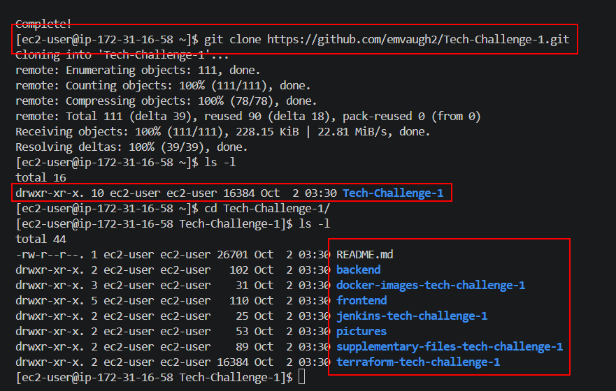

Lets get the backend running. We'll be accessing it on port 8080 and it should display an ID message or a success message. First, install npm and node using the following commands:

- curl -o- https://raw.githubusercontent.com/nvm-sh/nvm/v0.39.7/install.sh | bash
- source ~/.bashrc
- nvm install --lts

Verify by using the node --version and npm --version commands. ONce installed, run `npm ci` in your backend file. Then, run `npm start` to get your backend running. Before you do that, make sure your CORS_ORIGIN says `'http://localhost:8080'`. Eventually we'll update this but for now, we'll test on the localhost which is the EC2 instance. 

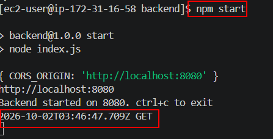

Normally, we would test using a web browser but since I'm using an EC2 instance, we're just going to do a curl test to localhost on port 8080. You can barely see the id verification but it's there. 

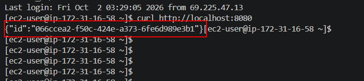

Lets get the frontend running. We'll be doing the same test. We should get the other success message. First, make sure the security group (SG) has ports 3000 and 8080 open. Then, edit your CORS_ORIGIN and API for your backend and frontend to be `http://<elastic-public-ip>:XXXX` for whichever backend or frontend you're in. I was running into some issues so I had to change the version of nvm I was running. I used the commands `nvm install 16` and `nvm use 16`. Then I reran my frontend commands to get my frontend running. 

Run the backend in one terminal and then open another terminal to run the frontend. 

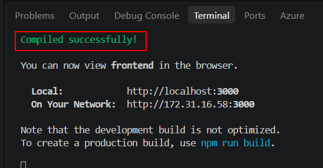

You should see the Compiled successfully message in the second terminal. Navigate to the EC2's public IP (PIP) to see the actual success message. I changed it to FRONTEND SUCCESS just for this phase. This is the real message we'll be testing throughout the project. 

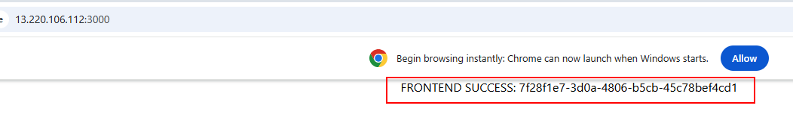

Lets move onto Phase 2 where we containerize all of this. 

## Phase 2: Containerization & Local Testing

In this phase, we'll be doing the same thing from Phase 1 except we'll run the frontend and backend code in their own separate containers. Then, we want those two containers to be able to talk to each other. 

I had to make a few changes to the source code to get these to run but I built Dockerfiles for both ends. First, lets install Docker and get the service running. 

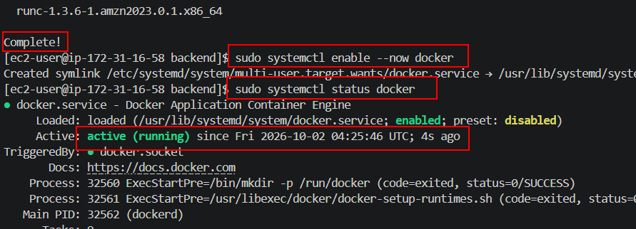

I already have the Dockerfiles from the tutorial but like I said, I updated them so they would work without error. Lets build the images from these files. We'll start with the backend. Use the command `docker build -t frontend:v1 .` Then we'll create the frontend image. Use the command `docker build -t backend:v1 .` Make sure to run these in their respective directories. 

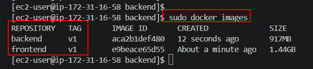

Lets get both of these containers up and running and then get them to communicate. Use the commands

- docker run -d --name backend-app -p 8080:8080 backend:v1
- docker run -d --name frontend-app -p 3000:3000 frontend:v1

to accomplish that. Make sure you frun the backend first. Verify that they're running using the `docker ps` command. 

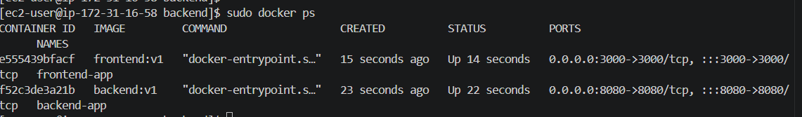

Lets verify the frontend and backend are running. We can do a simple curl test for the backend check. Run `curl http://localhost:8080` on your EC2 instance. You should ge the id output again. I'm actually going to go to port 3000 in the web browser so you can see the message more clearly.

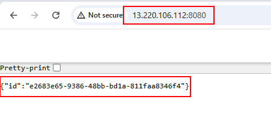

Navigate to the same PIP but on port 3000 for the frontend success message. I changed it to CONTAINER SUCCESS for this phase. 

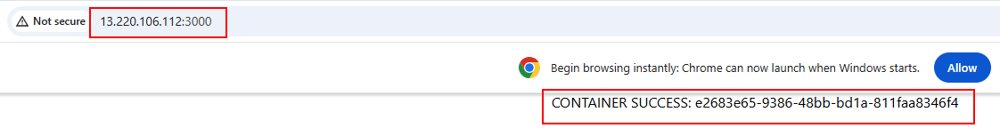

This proves that the frontend and backend code can communicate with one another in in their seperate containers. How cool is that? Lets take it a step further and deploy all of these automatically using Elastic Container Services. 

## Phase 3: Infrastructure Provisioning (Terraform)

So in Phase 3, we're all about Terraform (TF). This was the scariest phase because there were SO many TF files to create. There were a lot of errors and refining to comb through. I speak about all my issues in my personal notes so I'll just give the tutorial here and oversight. 

Here were some of the biggest issues:
- Understanding AWS's IAM roles. There were specific roles like task executions for the ECS service and logging that needed to be configured and attached to different services
- The SGs needed to allow specific traffic to the frontend and backend. We eventually found out the health probes were unhealthy so we needed to change the backend's source traffic to the Application Load Balancer (ALB).
- We had place holders for some of the image lines and repository lines since I didn't have those created yet. This caused later deployment issues

I could go on and on about this section alone. I did my best to use the TF website's resource blocks and craft them into my own with help from Copilot. My code was pretty close to the tutorial's code. That made my heart warm. I'll just give you an overview of my file structure. 

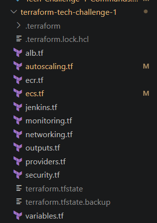

I also made a few changes compared to the tutorial. I lowered the CPU Utilization threshold to 15% to demonstrate load scaling. Now, lets actually deploy our infrastructure. We'll use terraform init to get our TF started, terraform fmt -recursive to fix all formatting issues, terraform validate to check for configuration errors, terraform plan to see what will be happening, and then terraform apply to deploy. 

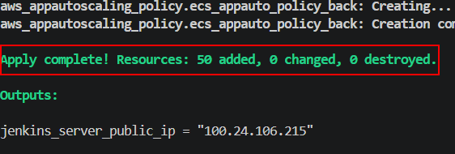

You can see we created 50 resources and the only output variable was the Jenkin's public server. A few resources were created were the entire VPC, IAM roles, ECS + Fargate, ECR, CloudWatch, Autoscaling, the Jenkin's server, and the ALB. 

Lets move onto Phase 4!

## Phase 4: Jenkins Setup on AWS

In Phase 4, we're getting our Jenkins server ready to run our pipelines automatically. So we're going to spin up an EC2 instance and run Jenkins as a custom container. Why? Because we need to make sure the Jenkin's container docker commands can interact with our EC2 instance's docker daemon. We completed this in a previous lab but the jenkins user needs to be in the same group as our host docker group. It's easier to run this in a contain automatically. 

Log into your EC2 instance and install Docker. Get that up and running. Now, find the docker group so we can insert that into our container. 

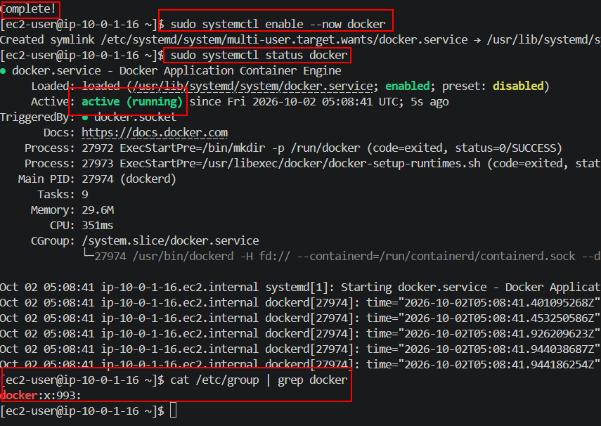

Lets install Git and clone our repo so we'll have our Jenkins Dockerfile. It's located in the docker-images-tech-challenge-1 folder. You may need to change your group id to match whatever group your jenkin's EC2 instance has. Mine container still matches so I'll go ahead and build my image so we can get logged into the Jenkins portal. Run 'docker build -t custom-jenkins:latest .' in the directory to build the image. Then lets run the container. 

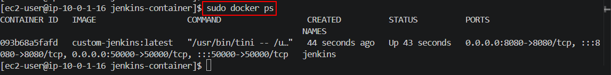

Now access the Jenkins container UI on the PIP using port 8080. They give you the command `sudo docker exec jenkins cat /var/jenkins_home/secrets/initialAdminPassword` to get the admin password. Create an account so you can have your own credentials. Install the suggested plugins although I don't think you'll need them since Git is already installed. 

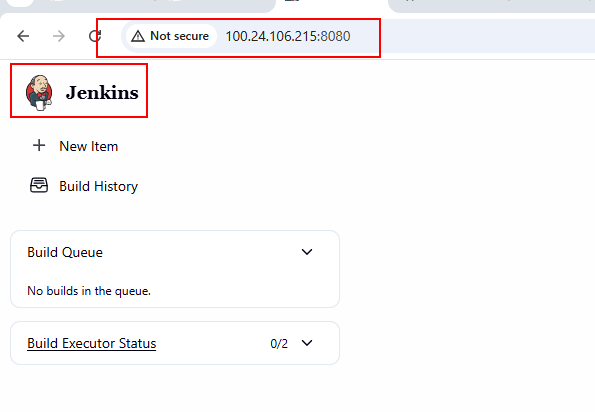

Lets create some credentials. We want to create a GitHub PAT Token and our AWS Credentials. You'll need to install the AWS Credentials plugin. 

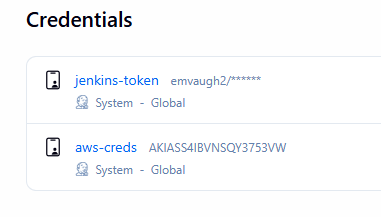

Once we're done there, we can start building our pipeline! Lets go to Phase 5.

## Phase 5: Create your CI/CD Pipeline

We're going to created our Jenkins pipeline to grab our frontend and backend Dockerfiles, created images out of them, push them to the ECR, and then have ECS run them. We're also going to automate this process by creating a GitHub webhook that automatically runs our pipeline when we push any updates to GitHub. 

Use the Jenkinsfile we created and push that to your GitHub. Once you do that, we'll create our pipeline. Make sure you swap out your back and frontend repo URIs. 

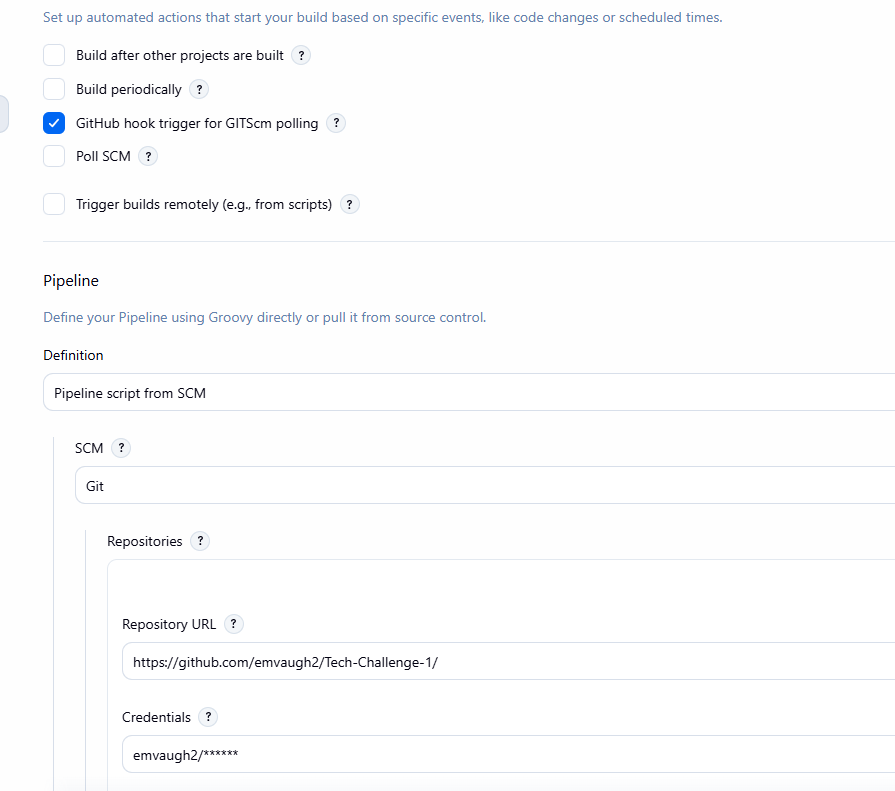

You'll create the Jenkins pipeline using a trigger this time. The trigger will look like the above. We need to also create out Git webhook. Before that, you can verify that the pipeline works. I ran into an issue here previously. My EC2 instance was too small and it couldn't handle the workload. I had to upgrade it to a t3.small instead of a micro.

You'll get a SUCCESS message for your pipeline if it works. 

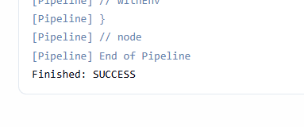

## Phase 6: Deploy Application and Validate

We'll actually save the webhook for here. Once we create it, we'll edit one of out files, push it to Github, and the 

## Personal Notes

GitOps Notes:

We need to create the gitops branch for out changes in our repo. We created the IAM role and access information in the AWS Console. Now lets fill in the deploy.yml file. Once I filled this in, I ran into the WithWedIdentity issue every time I deployed my changes to GitHub. After some googling, there was an article about immutable repos or something that I gave to Copilot. I also had this repo line under my Settings > Actions > OIDC where I had to copy and paste that. We created a new trusted relationship policy and this allowed the automated deployed!

I was finally able to test for my GitOps success message and we finished this entire thing up. 

10/02/2026

We got everything to work!!! Okay nice. So the backend listener rule had the path `/api/*` so anything that matched at least `/api/` at the end of the ALB would get routed to the backend. This his how we were able to see the backend ID message. The backend code said app.get which grabs the id: ID. Then is shows id with some UUID. I still don't quite understand the frontend part so we'll need to review that. 

We just created the webhook. We disabled SSL as well but everything else was pretty much by the book. About to test it out. Once I fixed the typos, we were good to go! So we're almost done with this. How beautiful. 

Okay we changed the scaling policy from 50% to 15% CPU Utilization because we couldn't install siege and our other test wasn't generating the traffic load needed to scale it up. 

Last but not least, we need to use GitOps for our CI/CD pipeline now instead of Jenkins. 

10/01/206

Lets talk about Phase 5 which is the real final phase. The rest is testing and using GitOps. Okay now we're getting our Jenkinsfile together. All I really had to do was put in my region and my ECR frontend and backend URIs. You can find this in the AWS console. 

I needed to also come up with my file tree structure before I created my GitHub repo online. I created it but I organized all my files first before I pushed them up. It caused some issues because of a duplication error but once I removed the empty Tech-Challenge-1 folder, I was able to push my code up. I had it ignore my .pem file as well. 

I forgot to include the frontend and backend additional files in my push to my repo so I had to clone the challenge repo again to my Downloads folder, then move them over to my frontend and backend directories. I also messed this up because I accidentally copied the entire frontend directory into my frontend directory. So it was frontend/frontend/src. Same with the backend directories.

Now, I followed the instructions for the CI/CD pipeline build. I had to modify my script path to fit exactly what I have in my GitHub repo `jenkins-tech-challenge-1/Jenkinsfile`. I ran the pipeline to test it out before the GitHub webhook. It made it to the frontend Dockerfile and got stuck at RUN npm install. Apparently this can be resource intensive. I'm going to reboot my instance in a second. 

Okay after about 45 minutes, I decided to stopped the instance, upgrade it to a t3.small, and start it back up. The public IP changed automatically. I'm able to log back into it now. I had to restart my Jenkins container using `docker start jenkins`. 

So the pipeline failed. This was probably due to the instance restart. We're going to test on our EC2 instance outside of our Jenkins container to make sure that the frontend image is being created properly. Okay this time it ran without any issues! But we noticed the ECS wasn't pulling the right image. We found this out by going to both of the ECS frontend and backend services and looking at the Events (basic the logs). It showed the error `CannotPullContainerError`. It was looking at the docker.io registry and not my ECR I believe. We needed to grab the ECR URIs for both the frontend and backend images, create a new revision in the ECS service for the frontend and backend, and replae the image with the ECR URI followed by :latest. For example, `177989593957.dkr.ecr.us-east-1.amazonaws.com/backend-repository:latest`. 

After that, go back to your clusters and update both frontend-ecs-service and backend. Use the latest revision and press save. They should run again. That's working now but when we went to the ALB's URL, we got a failure to fetch. Now, I'm getting sleepy at this point so AI is doing the heavy lifting. It appears we need to change our CORS_ORIGIN and our API URL in our backend and frontend in order to get this going. 

Go into frontend and config.js. Change the local host to http://tech-challenge-1-alb-486707836.us-east-1.elb.amazonaws.com/api. Then go into the same file in the backend and put the same URL but remove the `/api` at the end. After you push your changes to your GitHub repo, make sure you check the repo to make sure the changes are there. Now, Build Now again in Jenkins. 

We were still running into the Failed to fetch issue. I think we determined it's because the backend SG had the wrong source. We needed to change this to ALB security group. 

***** MAKE SURE TO ADD THIS TO TERRAFORM ***** (I believe I did)

Low key we got it to work on the /api/test URL path. Now we have to get the regular URL to work. 

09/30/2026

Okay we're moving onto Phase 4 of the porject which is setting up the Jenkins server in AWS. I'm going to deploy my resources again and get logged into the Jenkins server. We need to update our packages so we'll run an update and upgrade in dnf right quick. Then, lets install docker and get the service started. Now, we need to get the Jenkins container running. I remember two things we had to do: link the docker.sock socket from the host machine to the container. We also needed to make sure the docker groups matched on the container and the host machine which means we need to add docker as a secondary group to the jenkins user on the container. This is to allow the Jenkins container to actually use Docker. So in that case, we need to create a custom Jenkins Dockerfile. I'll include that in the documentation. 

We got that up and running. Now lets get logged into the Jenkins UI and get the plugins installed. We can also install these plugins while the container is being created. I added the lines in the Dockerfile. We need to install the AWS CLI `apt-get install -y awscli`. The Git CLI is already installed. You have to log into the container as root and not jenkins to install these packages using apt-get. 

You'll also need to install the AWS Credentials plugin inside the Jenkins UI. Also, follow the documentation for the GitHub PAT token. You go to Settings and look at the very bottom of options on the left side of the screen. You'll see Developer settings or whatever.

Okay I entered my AWS token as well. You'll need to go to the AWS Console, click on your username and click Security Credentials. I had to generate a new Access Key which it then gave me the secret to go with it. I entered this information in Jenkins. I asked Copilot to give me some verification checks that these creds work so it gave me one for GitHub, one for AWS, and another for Docker. I used my No Zero Days repo for the GitHub check. After you run the pipeline, go to Workspaces to see the cloned repo. That was pretty cool. 

The AWS and Docker checks came back successfully too so this is great. Lets move on to Phase 5. 

_____________
This project was a little overwhelming at first. I didn't think it would be this involved especially connecting the frontend to the backend portion because I'm simply not used to working with front or backends. So that was my first plan of action. What does verification of this process look like? So I wanted to make sure I got the right message when running the application. Apparently, the frontend will just show you the `ID` that the backend has. So the frontend and backend both show the same information when you visit the web server on port 8080 or 3000. 

While I was able to get the frontend and backend portions working on my local machine (an EC2 instance), it became another problem when I tried to access the frontend on my EC2 instance's PIP. I had to go change the CORS origin in my backend I believe to match the PIP. Well, if you do this on the fly, the code doesn't like it so much. I kept running into an error message with the backend saying there was already a process listening on port 8080. So I had to use `ss` to find that process (and the frontend process), use `kill -9 <process-id>` to stop both processes, and then restart them in different terminals. Once I did this, I was able to receive the frontend message. 

To even see some of these issues, I had to go into Google Chrome's JavaScript panel to see there were networking issues on localhost and cross domains (CORS) which I've never done before in my life. That's the page you just accidentally click on when you're moving too fast in your web browswer. So it was interesting having to use that to troubleshoot. 

(package.json is like the node.js equivalent of the requirements.txt file for Python). (npm run build stores React source code into static HTML, CSS, and JS files and puts them in a build folder). (serve is a lightweight web server. Think Apache but tiny). (serve -s build starts the web server)(npm start is for developers and development mode. since we're going to prod, we use npm run build and server -s build). 

I built the images in each respective directory but when I ran the containers, I put an `.` at the end. That overrode the CMD command and broke the images so moving forward, do not put a period at the end of the `docker run` command. Also, I changed the success message in my frontend container using single quotes instead of backticks ``. So I was able to get the confirmation message on the web browser but it didn't appear the way I thought. So I stopped the container, removed it, edited my App.js file, rebuilt the image as v2 and ran it again. 

Okay we got that up and running. Here's the overall big picture with running these containers next. We're going to use Elastic Container Registry (ECR) to store our images after the Jenkins pipeline creates them. We'll use Elastic Container Services (ECS) to run our containers and it will pull them from ECR. Usually, we would run our containers on a VM like EC2 but we can instruct ECS to run our containers on Fargate which is just compute that we don't have to manage. Like serverless containers instead of using a VM. 

Terraform troubleshooting notes:

09/25/2026

Everything deployed perfectly. I did add a listener rule for the backend group since that was the only thing in the solution that I didn't have. I made the edits. Hopefully it will still deploy perfectly. 

09/24/2026

We're working on the ecs.tf file again. I'm comparing my file with the answer file. The answer file has the CloudWatch resource block in the ecs.tf file but I moved this to my monitoring.tf file. I also needed to add the task_role_arn to my ecs_task_definition blocks. The execution role allows ECS to do tasks. The task role allows the application inside the container to execute tasks. Since the application isn't an AWS resource, we're going to create the role but not assign it to anything. AWS will just pass this role to the application if the application wants to do anything AWS related. 

I copied some of the CloudWatch code because I'm not sure where they even got this from. I can't find it on the Terraform website. Also, the awslogs-stream-prefix basically says name log streams starting with ecs. Everything else is straight forward. Also, the essential = true makes ECS make sure the container is healthy before it says the ECS task is healthy. 

I put together the ALB and Autoscaling files. These were straight forward enough although AI had me change the autoscaling policy from a step policy to a target tracking policy. Once we did that, I ran through my Terraform commands. Then I ran into an issue with the ecs.tf file. The container defintion name didn't match the load balancer container name I believe. I fixed that for both the frontend and backend. 

Then I ran into another issue. I needed to fix the type of policy for my autoscaling. I kept it to StepScaling whenI changed it earlier. 

09/23/2026

So we worked on fixing the cycle between the frontend and backend dependency when it came to the security group. Since they relied on each other, Terraform couldn't build it. We changed the egress for the frontend poll to by any-any. We let the backend pool keep the frontend security group and changed the backend to any-any. Also, for my IAM roles, I had to change ecs.amazonaws.com to ecs-tasks.amazonaws.com. 

Just ran a terraform fmt -recursive, validate, and plan. I had to remove a lot of the tags in the networking.tf file but once I did that, my apply went through. Going to destroy everything and start on the next module. 

Created my ecr.tf file. This was pretty straight forward. I just copied the blocks from the Terraform website. I didn't change anything in either file. Just made sure I paired the blocks together. The policy states that all images be recycle after 14 days. Works for me. I had to go back and fix the name of the repos because AWS didn't like the capital letters. I changed everything back to lowercase (Frontend-Repository to frontend-repository) and then the apply worked. 

08/2026

I had to ask Copilot how to think about the IAM roles here. As an Azure engineer, I'm not particularly used to having to grant services or resources permissions to do things. They're typically just allowed to do what they need to do. In AWS, if you don't give a service the right role and policy, it won't work. So we needed to give the ECS service the task execution permissions. We also wanted to allow it to create logs for us in CloudWatch. Both of these require a role. I thought the Jenkins server would need a role. Maybe it doesn't right now. I'm like, does the ECR need a role? Fargate? I'm still learning the distinctions between things but also, to set these up, you should also look at the AWS documentation. It will tell you what needs a role and what doesnt. Okay cool. So we needed to create two roles for ECS: task execution and the logging role. Task execution role is mandatory. You can copy the code from the TF AWS IAM webpage. The only thing you're really changing is ec2 to ec2 and giving it a specific name. As far as the policy_arn, now I already knew what that was because of the solution. But I didn't want to copy this. I tried to find it myself on the Terraform website. No dice. I went to the AWS console and went to IAM. I found the AWS-managed policy myself and it had a copy button for the ARN! So that was refreshing to know if I need to do this in the future (say I'm following the wizard and it tells me the policy but I don't know what that looks like for TF) then I know I can find it in the console and copy it. 

Now, the logging policy was a custom policy. You can copy and TF code for this as well but in the Actions section, you can list off all the permissions you want using "<permission>", to separate each permission. To read these permissions, the first part denotes the service so you'll see things like s3, ec2, ecr, logs, etc. That lets you know which service this policy is acting ON. The next part says what the permission is. The logs category is for CloudWatch actually. The good thing about this as well is you can go into the custom policies in the column and use the JSON view. It will show you how the each permission would show up in JSON which is pretty much how it would show up in Terraform as well. Use the JSON to help you write custom codes in TF. 

Last but not least, once you create the roles and policies, you need to create another resource block to attach the policy to the role. The policy_arn syntax is different for custom policies as opposed to AWS-managed policies so keep that in mind. 

